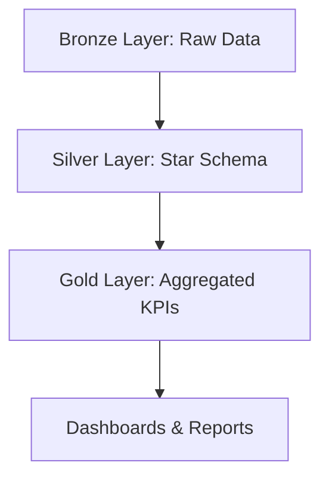

# 📊 Olist E-commerce Data Warehouse (SQL Server)

---

This project builds a SQL Server–based Data Warehouse using the Brazilian Olist E-commerce dataset.
It follows the Medallion Architecture (Bronze → Silver → Gold) to ensure data quality, scalability, and analytics readiness.
The warehouse supports KPI dashboards and business insights for e-commerce operations.

---

# 📂 Folder Structure

```
olist-sql-dwh/
│── README.md                # Documentation for GitHub
│── /docs/                   # Any ER diagrams, architecture images, notes
│   └── star_schema.png
│── /bronze/                 # Raw schema + stored procs
│   ├── bronze_schema_creation.sql
│   ├── stored_procedure_for_bronze.sql
│   └── table_analysis.sql   # profiling raw data
│── /silver/                 # Star schema + stored procs
│   ├── silver_schema_creation.sql
│   ├── silver_layer_creation.sql
│   ├── stored_procedure_for_silver.sql
│── /gold/                   # Aggregates, views, KPIs
│   └── Query_for_gold_layer.sql
│── /analysis/               # Analysis + dashboards
│   ├── analysis_v1.sql
│   └── table_analysis.sql
│── /setup/                  # Database setup scripts
│   └── SQLQuery_to_create_database.sql
```

---

## 🚀 Project Highlights

* **Database**: SQL Server
* **Architecture**: Medallion (Bronze → Silver → Gold)
* **Modeling**: Star Schema (Fact + Dimension tables)
* **Data**: [Olist Brazilian E-commerce Dataset](https://www.kaggle.com/datasets/olistbr/brazilian-ecommerce)
* **Analytics**: KPI queries and dashboards (Power BI / Tableau compatible)

---

## 🏗️ Project Architecture



---

## 📂 Repository Structure

```
olist-sql-dwh/
│── README.md                # Documentation
│── /Schema_architecture/    # Diagrams, notes
│── /Bronze/                 # Raw schema + SPs
│── /Silver/                 # Star schema + SPs
│── /Gold/                   # KPI Views
│── /Validation/             # Ad-hoc queries
│── Database_and_Schema_Creation.sql # Creates Database and Schema
```

---

## 🔑 Layers Explained

### 🥉 Bronze Layer

* Raw import of all 9 Olist CSVs into SQL Server
* Minimal changes (staging tables)
* Scripts:

  * `bronze_schema_creation.sql`
  * `stored_procedure_for_bronze.sql`

### 🥈 Silver Layer

* Cleansed and normalized the tables
* Fact tables: `fact_orders`, `fact_order_items`, `fact_payments`, `fact_reviews`
* Dimension tables: `dim_customers`, `dim_products`, `dim_sellers`, `dim_geolocation`, `dim_date`
* Scripts:

  * `silver_schema_creation.sql`
  * `stored_procedure_for_silver.sql`

### 🥇 Gold Layer **Star Schema**

* Aggregated views for KPI dashboards
* Examples:

  * Sales by product category
  * Orders by state and month
  * Average delivery time by region
  * Payment method breakdown
* Script:

  * `Query_for_gold_layer.sql`


## 🛠️ How to Run

1. Create the database:

   ```sql
   -- Run from /setup
   SQLQuery_to_create_database.sql
   ```

2. Load Bronze Layer (raw tables):

   ```sql
   -- Run from /bronze
   bronze_schema_creation.sql
   stored_procedure_for_bronze.sql
   ```

3. Build Silver Layer (star schema):

   ```sql
   -- Run from /silver
   silver_schema_creation.sql
   stored_procedure_for_silver.sql
   ```

4. Generate Gold Layer (KPI views):

   ```sql
   -- Run from /gold
   Query_for_gold_layer.sql
   ```
